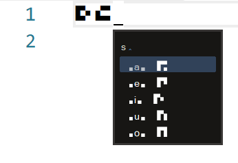

# migasiSIM

An input schema for migasi's constructed language.

## Install

1. Download and install the font [migasiS](https://github.com/zitem/migasi-font/).otf.

2. Install [RIME](https://rime.im/).

3. Rime -> 輸入法設定 -> 獲取更多輸入方案...

    `Enter ... to install: zitem/migasiSIM`

4. Find the directory of

    `Cloning into '.../plum/package/zitem/migasiSIM'...`

5. Copy lua & rime.lua to Rime user directory. If files already exist, do someting.

6. Close Rime package installer and complete your setting (方案選單設定).

## Usage

* Check phonemes by [PDF](https://github.com/zitem/migasi-font/blob/main/Phonemes.pdf).

## Dependencies

* [migasi-font](https://github.com/zitem/migasi-font/)
* [rime](https://rime.im/)
* [plum](https://github.com/rime/plum)